# Portal de Solicitações Internas

Teste prático de entrevista — BIT Analista.
**Autor:** Lucas de Souza Pegoretti

Aplicação web em que colaboradores registram demandas internas (TI, RH, Compras, Financeiro,
Infraestrutura) e acompanham sua evolução até a conclusão. Possui backend (API REST),
frontend (SPA leve em HTML/CSS/JS) e persistência em banco de dados SQL (SQLite).

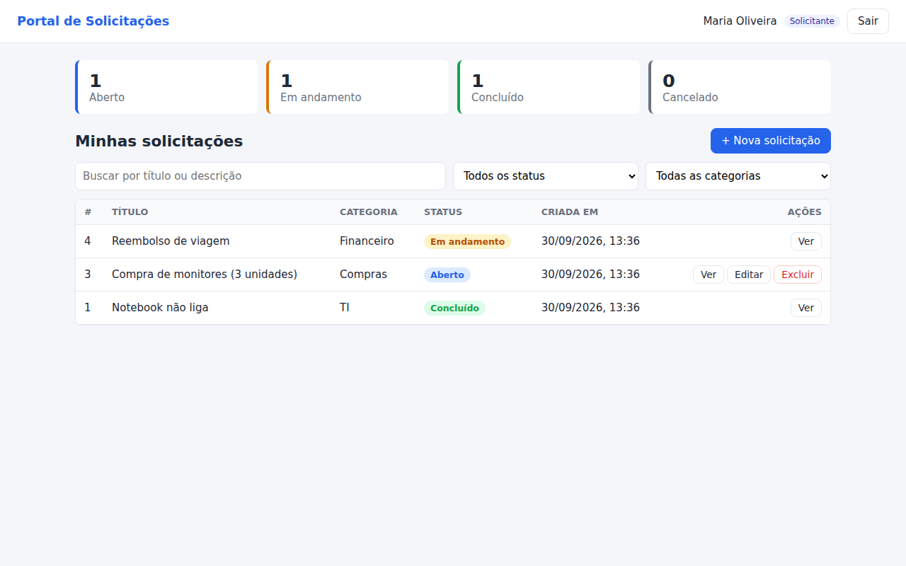

## Funcionalidades

| Requisito | Implementação |
|---|---|
| Login com usuário e senha | `POST /api/auth/login`; senha validada contra hash **scrypt** com salt |
| Controle de sessão | Token aleatório em cookie `HttpOnly`/`SameSite=Strict`, gravado na tabela `sessoes` com expiração de 8 h |
| Logout | `POST /api/auth/logout` remove a sessão do banco e o cookie |
| Apenas autenticados acessam | Toda a API (exceto login) retorna `401` sem sessão; a página principal redireciona para `/login.html` |
| Criar solicitação (título, descrição, categoria) | `POST /api/solicitacoes` |
| Campos automáticos | Data de criação, usuário solicitante (usuário logado) e **status = Aberto** são definidos pelo servidor — valores enviados pelo cliente são ignorados |
| Editar / excluir solicitação aberta | `PUT` / `DELETE /api/solicitacoes/:id` — somente o próprio solicitante e somente com status **Aberto** |
| Acompanhar evolução | Status `Aberto → Em andamento → Concluído` (ou `Cancelado`), alterado pelo perfil **Atendente**, com histórico/linha do tempo e comentários |
| Extras | Painel-resumo por status, filtros (busca, status, categoria), layout responsivo, testes automatizados |

## Tecnologias

- **Backend:** Node.js 22 + Express 5
- **Banco de dados:** SQLite 3 via módulo nativo `node:sqlite` (sem dependências nativas para compilar)
- **Frontend:** HTML5, CSS3 e JavaScript puro (sem build), servido pelo próprio backend
- **Testes:** `node:test` (runner nativo do Node)

## Estrutura

```
.
├── backend/
│   ├── package.json
│   ├── src/
│   │   ├── server.js            # ponto de entrada (porta, arquivo do banco)
│   │   ├── app.js               # configuração do Express, rotas e páginas
│   │   ├── db.js                # conexão SQLite, criação do schema e seed
│   │   ├── auth.js              # sessões, cookies e middlewares de acesso
│   │   ├── senha.js             # hash/verificação de senha (scrypt)
│   │   └── routes/
│   │       ├── auth.js          # login, logout, usuário atual
│   │       └── solicitacoes.js  # CRUD + mudança de status + histórico
│   └── test/api.test.js         # testes de integração da API
├── frontend/
│   ├── login.html
│   ├── index.html
│   ├── css/styles.css
│   └── js/{login.js, app.js}
├── database/
│   ├── schema.sql               # script de criação das tabelas
│   ├── seed.sql                 # usuários de demonstração
│   └── DICIONARIO_DE_DADOS.md
└── docs/
    ├── MEMORIAL_TECNICO.md      # MEMORIAL TÉCNICO DE DESENVOLVIMENTO
    └── evidencias/              # prints da aplicação funcionando
```

## Como executar

### Pré-requisitos

- **Node.js 22.5 ou superior** (necessário para o módulo nativo `node:sqlite`). Verifique com `node -v`.
- npm (instalado junto com o Node).

Nenhum servidor de banco de dados precisa ser instalado: o SQLite é embarcado e o arquivo do
banco é criado automaticamente na primeira execução.

### Passo a passo

```bash
# 1. Clonar o repositório
git clone https://github.com/lucasouzape/BIT-Analista_teste.git
cd BIT-Analista_teste/backend

# 2. Instalar dependências
npm install

# 3. Iniciar a aplicação
npm start
```

Acesse **http://localhost:3000** no navegador.

Na primeira execução o backend cria `backend/data/portal.db`, executa `database/schema.sql`
(tabelas + categorias) e `database/seed.sql` (usuários de teste).

### Usuários de teste

| Usuário | Senha | Perfil | O que pode fazer |
|---|---|---|---|
| `maria` | `senha123` | Solicitante | Criar, editar/excluir as próprias solicitações abertas, acompanhar |
| `joao` | `senha123` | Solicitante | Idem (não enxerga as solicitações da Maria) |
| `admin` | `admin123` | Atendente | Ver todas as solicitações e alterar o status |

### Variáveis de ambiente (opcionais)

| Variável | Padrão | Descrição |
|---|---|---|
| `PORT` | `3000` | Porta HTTP |
| `DB_FILE` | `backend/data/portal.db` | Caminho do arquivo do banco |
| `SESSAO_HORAS` | `8` | Duração da sessão |
| `COOKIE_SECURE` | `false` | Use `true` quando servido por HTTPS |

Exemplo: `PORT=8080 npm start` (Linux/macOS) ou `set PORT=8080 && npm start` (Windows cmd).

### Testes automatizados

```bash
cd backend
npm test
```

Os testes sobem a API com um banco em memória e cobrem login/logout, bloqueio sem sessão,
CRUD, campos automáticos, isolamento entre usuários e regras de status.

### Reiniciar o banco

Pare o servidor e apague `backend/data/portal.db`; ele será recriado na próxima execução.
O banco também pode ser criado manualmente: `cat database/schema.sql database/seed.sql | sqlite3 portal.db`.

## API REST

Todas as rotas usam JSON. Exceto o login, todas exigem sessão válida (cookie `portal_sid`).

| Método | Rota | Descrição |
|---|---|---|
| POST | `/api/auth/login` | `{ usuario, senha }` → cria a sessão |
| POST | `/api/auth/logout` | Encerra a sessão |
| GET | `/api/auth/me` | Usuário logado |
| GET | `/api/categorias` | Categorias ativas |
| GET | `/api/status/transicoes` | Fluxo de status permitido |
| GET | `/api/solicitacoes?status=&categoria_id=&busca=` | Lista (solicitante: só as próprias) |
| GET | `/api/solicitacoes/:id` | Detalhe + histórico |
| POST | `/api/solicitacoes` | `{ titulo, descricao, categoria_id }` |
| PUT | `/api/solicitacoes/:id` | Edita (dono + status Aberto) |
| DELETE | `/api/solicitacoes/:id` | Exclui (dono + status Aberto) |
| PATCH | `/api/solicitacoes/:id/status` | `{ status, comentario? }` (somente Atendente) |

Códigos de erro: `400` validação, `401` não autenticado, `403` sem permissão,
`404` inexistente/não visível, `409` regra de status violada. O corpo traz `{ "erro": "mensagem" }`.

## Documentação

- [MEMORIAL TÉCNICO DE DESENVOLVIMENTO](docs/MEMORIAL_TECNICO.md)
- [Dicionário de dados](database/DICIONARIO_DE_DADOS.md) e [script de criação](database/schema.sql)
- [Evidências (prints)](docs/evidencias/)

## Evidências

| | |
|---|---|
| Login com erro de credencial 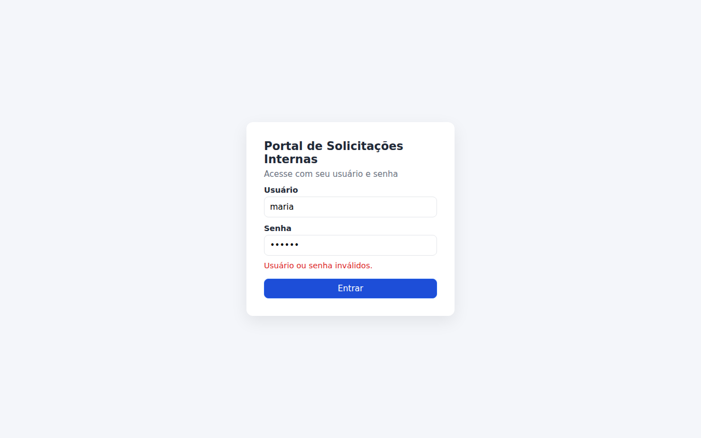 | Tela de login 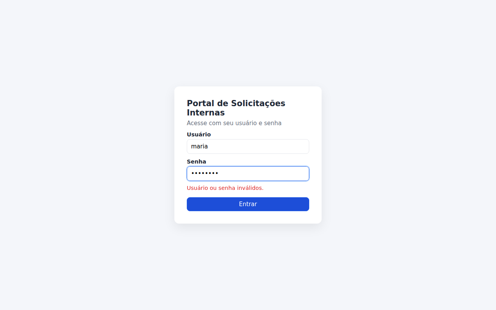 |
| Nova solicitação 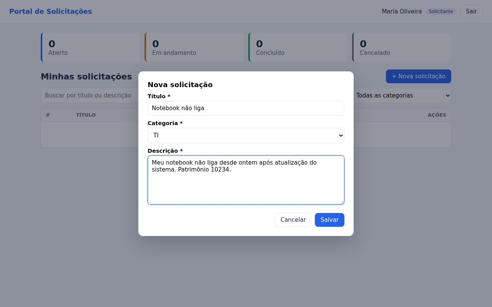 | Lista do solicitante 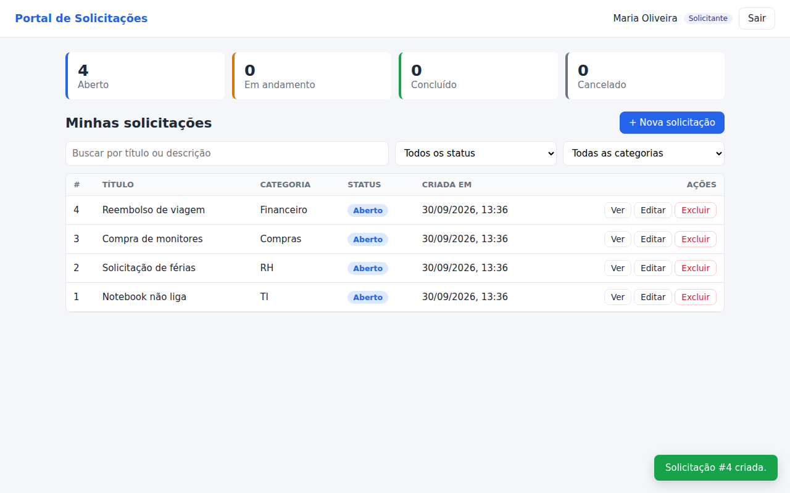 |
| Edição de solicitação aberta 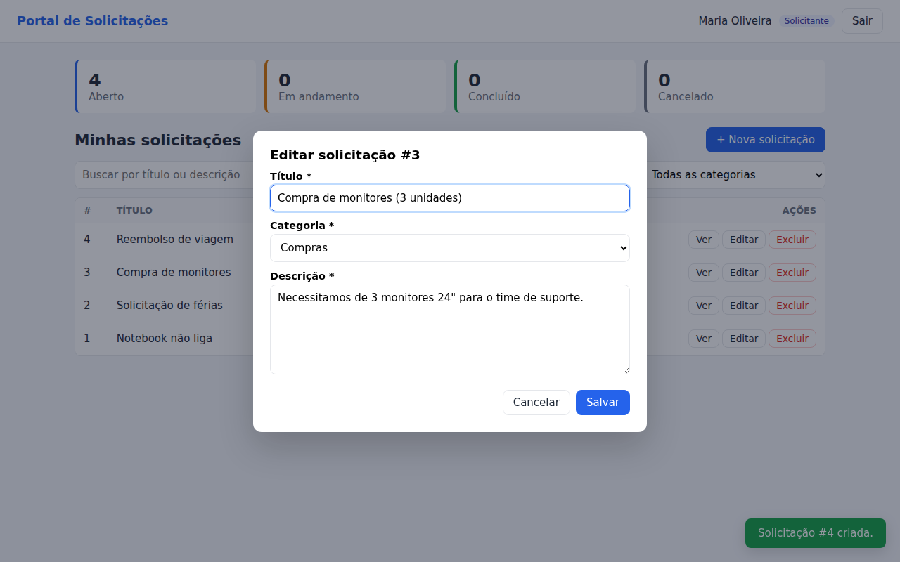 | Após exclusão 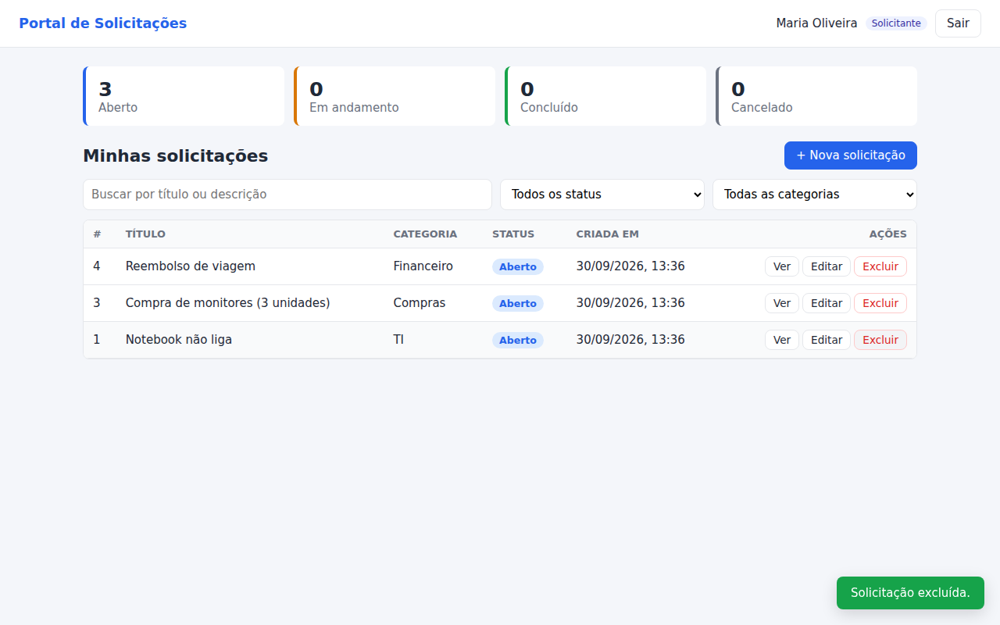 |
| Visão do atendente (todas) 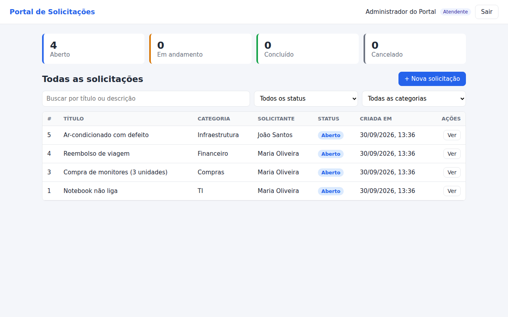 | Mudança de status e histórico 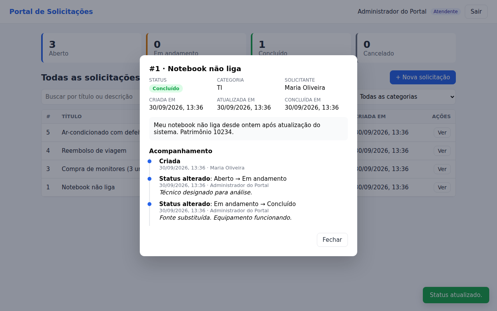 |
| Filtro por status 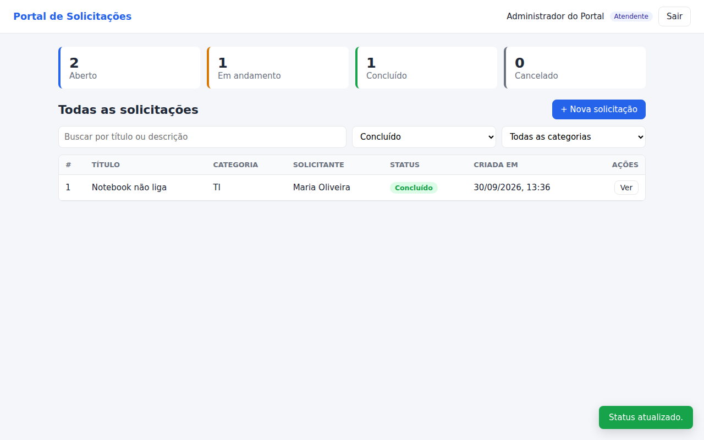 | Solicitante acompanhando (editar só em Aberto)  |
| Logout → acesso redireciona ao login 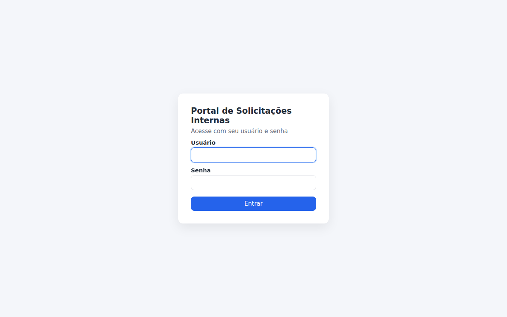 | Layout mobile 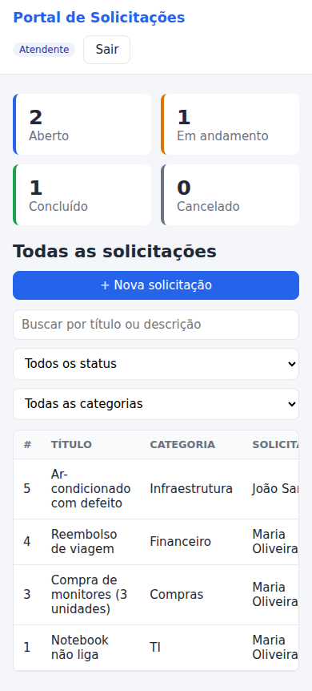 |

## Licença

MIT — ver [LICENSE](LICENSE).
