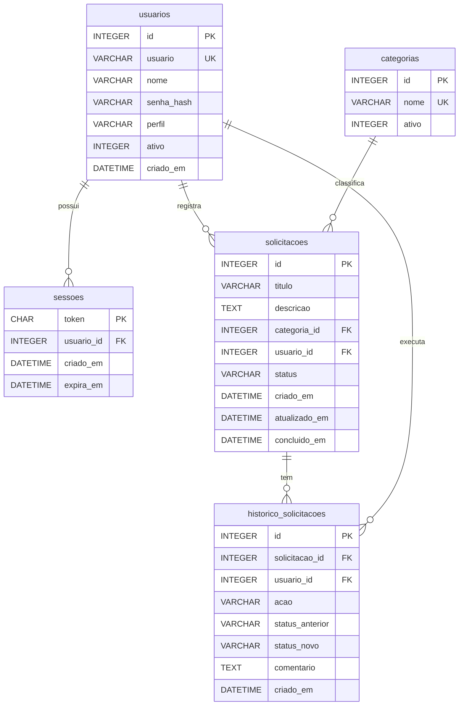

# Dicionário de Dados — Portal de Solicitações Internas

- **SGBD:** SQLite 3 (arquivo `backend/data/portal.db`, criado automaticamente)
- **Script de criação:** [`schema.sql`](schema.sql)
- **Carga inicial (usuários de teste):** [`seed.sql`](seed.sql)
- **Convenções:** nomes em português, `snake_case`, chave primária `id` inteira auto-incremental,
  datas em UTC no formato `AAAA-MM-DD HH:MM:SS` (`CURRENT_TIMESTAMP`).

## Diagrama Entidade-Relacionamento

---

## Tabela `usuarios`

Colaboradores com acesso ao portal.

| Coluna | Tipo | Nulo | Padrão | Restrições | Descrição |
|---|---|---|---|---|---|
| `id` | INTEGER | Não | auto | PK | Identificador do usuário |
| `usuario` | VARCHAR(50) | Não | — | UNIQUE | Login utilizado na autenticação |
| `nome` | VARCHAR(120) | Não | — | — | Nome completo exibido no sistema |
| `senha_hash` | VARCHAR(255) | Não | — | — | Hash da senha no formato `scrypt$<salt>$<hash>` (a senha nunca é gravada em texto puro) |
| `perfil` | VARCHAR(20) | Não | `SOLICITANTE` | CHECK `SOLICITANTE` / `ATENDENTE` | Papel do usuário. **Solicitante** vê apenas as próprias solicitações; **Atendente** vê todas e altera o status |
| `ativo` | INTEGER | Não | `1` | CHECK 0/1 | Usuário inativo (0) não consegue autenticar |
| `criado_em` | DATETIME | Não | `CURRENT_TIMESTAMP` | — | Data de cadastro |

## Tabela `sessoes`

Sessões autenticadas. Cada login gera um token aleatório de 256 bits enviado ao navegador em cookie `HttpOnly`.

| Coluna | Tipo | Nulo | Padrão | Restrições | Descrição |
|---|---|---|---|---|---|
| `token` | CHAR(64) | Não | — | PK | Token de sessão (hex de 32 bytes aleatórios) |
| `usuario_id` | INTEGER | Não | — | FK → `usuarios.id` (ON DELETE CASCADE) | Dono da sessão |
| `criado_em` | DATETIME | Não | `CURRENT_TIMESTAMP` | — | Momento do login |
| `expira_em` | DATETIME | Não | — | — | Expiração (padrão: login + 8 h). Sessões expiradas são rejeitadas e removidas periodicamente |

Índices: `idx_sessoes_usuario (usuario_id)`.

## Tabela `categorias`

Domínio de categorias das solicitações.

| Coluna | Tipo | Nulo | Padrão | Restrições | Descrição |
|---|---|---|---|---|---|
| `id` | INTEGER | Não | auto | PK | Identificador da categoria |
| `nome` | VARCHAR(50) | Não | — | UNIQUE | Nome da categoria |
| `ativo` | INTEGER | Não | `1` | CHECK 0/1 | Categorias inativas não aparecem para seleção |

Carga inicial: **TI**, **RH**, **Compras**, **Financeiro**, **Infraestrutura**.

## Tabela `solicitacoes`

Demandas internas registradas pelos colaboradores.

| Coluna | Tipo | Nulo | Padrão | Restrições | Descrição |
|---|---|---|---|---|---|
| `id` | INTEGER | Não | auto | PK | Número da solicitação |
| `titulo` | VARCHAR(150) | Não | — | — | Título informado pelo usuário |
| `descricao` | TEXT | Não | — | até 4000 caracteres (validado na API) | Descrição detalhada da demanda |
| `categoria_id` | INTEGER | Não | — | FK → `categorias.id` | Categoria escolhida |
| `usuario_id` | INTEGER | Não | — | FK → `usuarios.id` | **Automático:** usuário solicitante (o usuário logado) |
| `status` | VARCHAR(20) | Não | `ABERTO` | CHECK `ABERTO` / `EM_ANDAMENTO` / `CONCLUIDO` / `CANCELADO` | **Automático na criação:** `ABERTO` |
| `criado_em` | DATETIME | Não | `CURRENT_TIMESTAMP` | — | **Automático:** data de criação |
| `atualizado_em` | DATETIME | Não | `CURRENT_TIMESTAMP` | — | Data da última edição ou mudança de status |
| `concluido_em` | DATETIME | Sim | `NULL` | — | Preenchido quando o status passa a `CONCLUIDO` |

Índices: `idx_solicitacoes_usuario`, `idx_solicitacoes_status`, `idx_solicitacoes_categoria`.

**Regras de negócio:**

- Somente o **solicitante** pode editar ou excluir, e somente enquanto o status for `ABERTO`.
- Fluxo de status (alterado apenas por **Atendente**):
  `ABERTO → EM_ANDAMENTO → CONCLUIDO`; `ABERTO` ou `EM_ANDAMENTO` → `CANCELADO`.
  `CONCLUIDO` e `CANCELADO` são estados finais.

## Tabela `historico_solicitacoes`

Trilha de auditoria que permite acompanhar a evolução da solicitação até a conclusão.

| Coluna | Tipo | Nulo | Padrão | Restrições | Descrição |
|---|---|---|---|---|---|
| `id` | INTEGER | Não | auto | PK | Identificador do evento |
| `solicitacao_id` | INTEGER | Não | — | FK → `solicitacoes.id` (ON DELETE CASCADE) | Solicitação relacionada |
| `usuario_id` | INTEGER | Não | — | FK → `usuarios.id` | Quem executou a ação |
| `acao` | VARCHAR(20) | Não | — | CHECK `CRIACAO` / `EDICAO` / `STATUS` | Tipo do evento |
| `status_anterior` | VARCHAR(20) | Sim | — | — | Status antes da mudança (ação `STATUS`) |
| `status_novo` | VARCHAR(20) | Sim | — | — | Status após a mudança (`ABERTO` na criação) |
| `comentario` | TEXT | Sim | — | — | Observação opcional do atendente |
| `criado_em` | DATETIME | Não | `CURRENT_TIMESTAMP` | — | Momento do evento |

Índices: `idx_historico_solicitacao (solicitacao_id)`.
